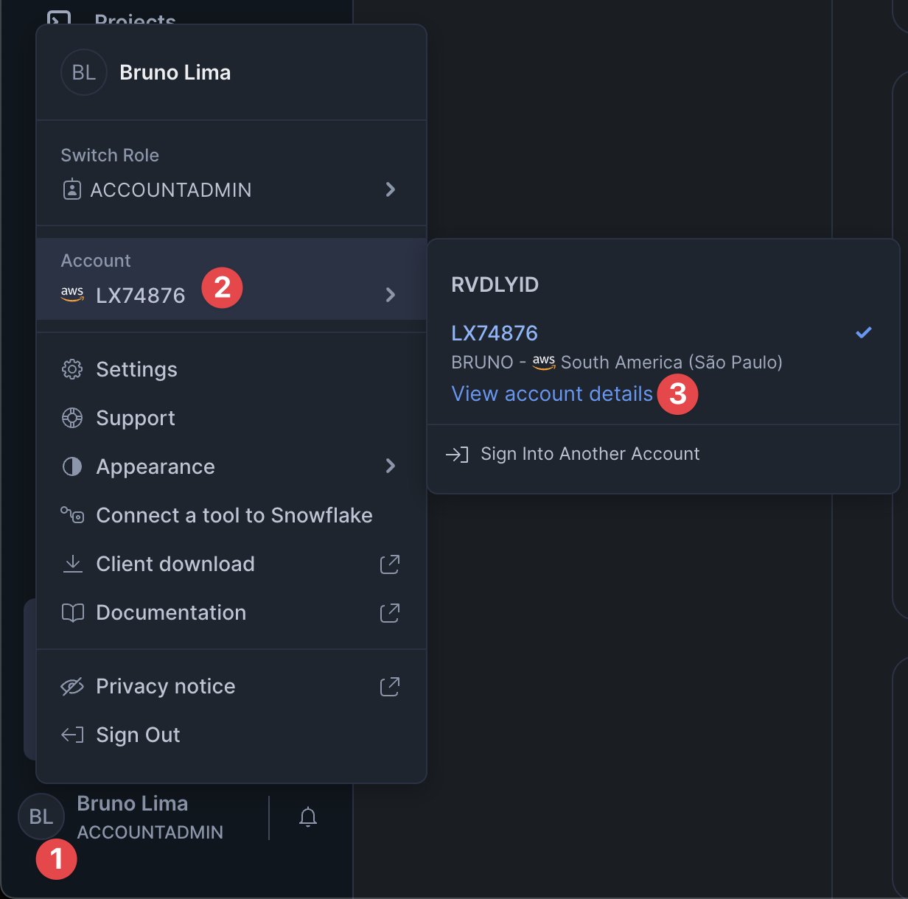
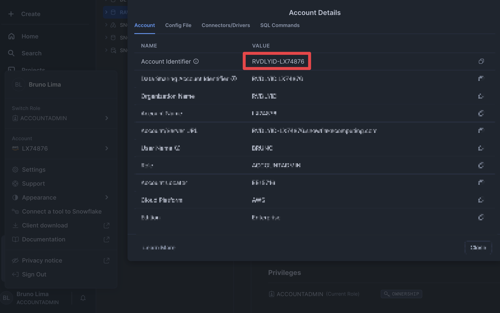
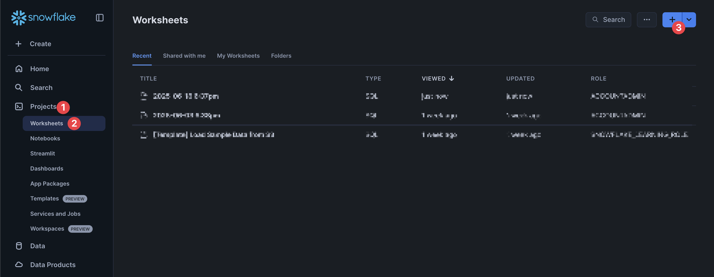
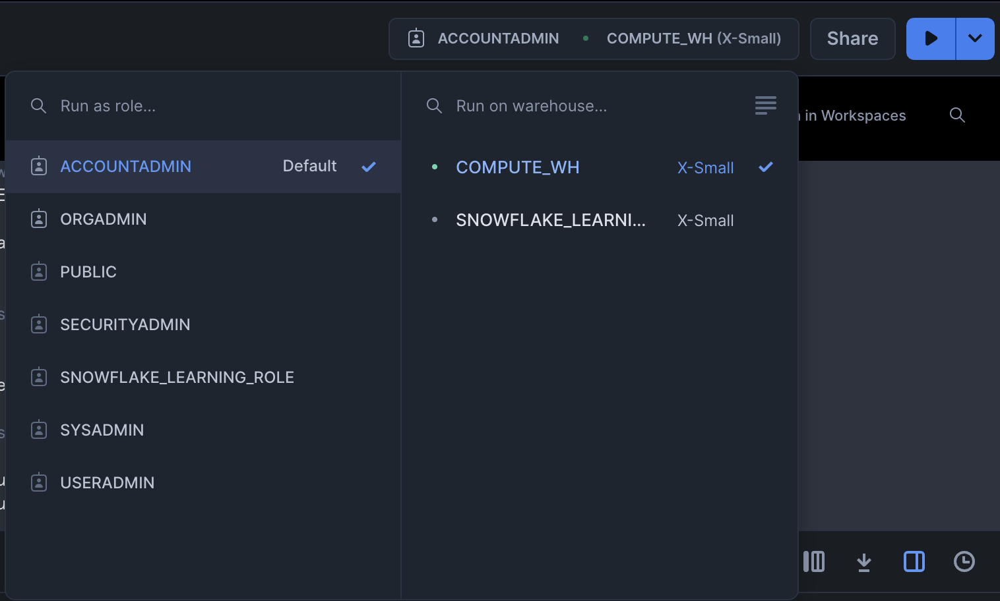
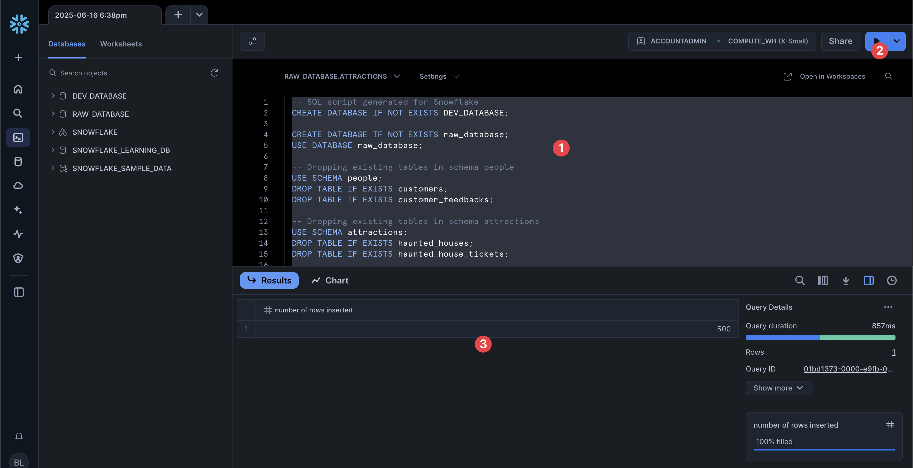
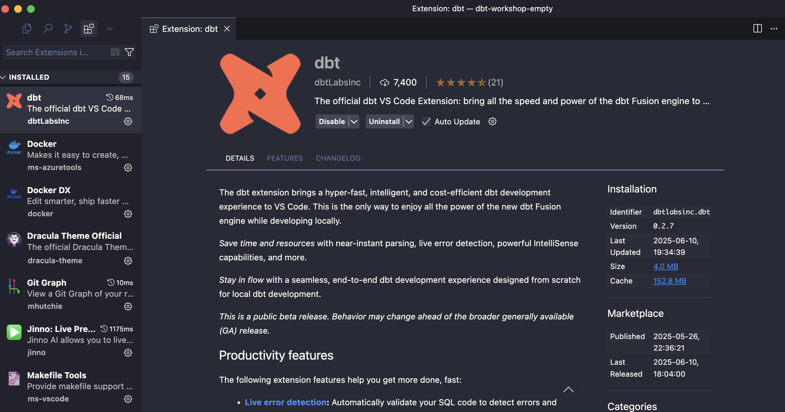
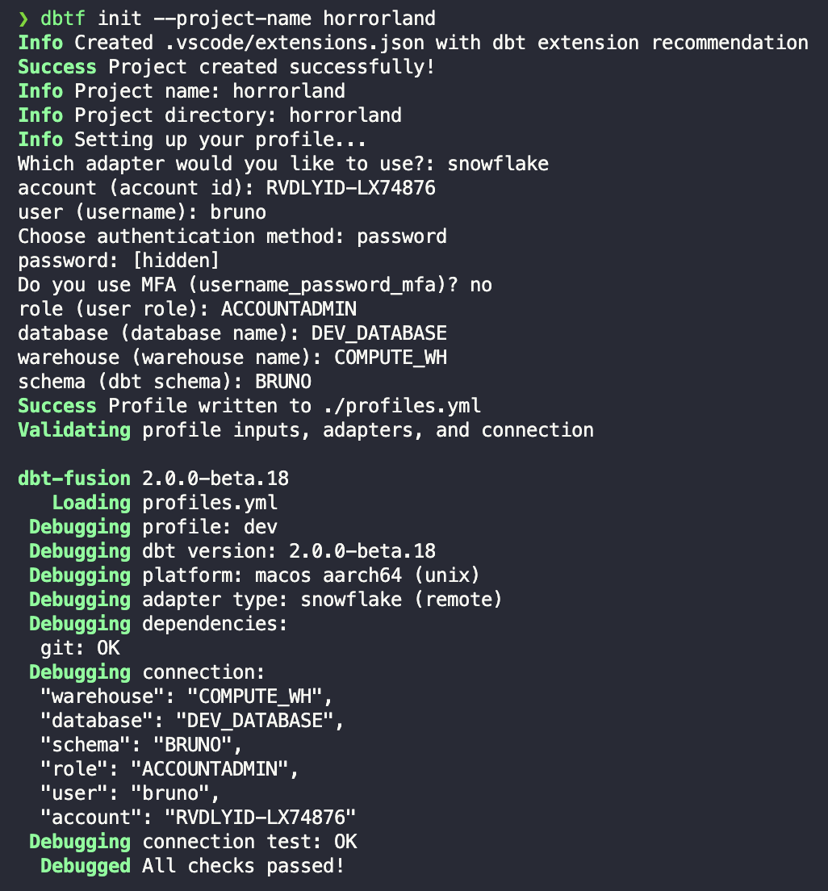

# 🎃 Horrorland dbt Workshop

[](https://www.datagym.io)

> 🚨 **IMPORTANT NOTICE – WORKSHOP TEMPLATE**
> This repository is used **exclusively for the DataGym.io workshop**.
>
> ✅ To work on your project:
>
> 1. **Clone this repository**
>
>    ```bash
>    git clone https://github.com/datagym-io/dbt-workshop-empty.git
>    cd horrorland-dbt-workshop
>    ```
> 2. **Create your own branch** (replace `<your_name>`):
>
>    ```bash
>    git checkout -b <your_name>
>    ```
> 3. Work only inside your branch.
> 4. **❌ Do NOT open PRs or merge anything into the `main` branch.**


---

## 📚 Table of Contents

* [👻 Context](#-context)
* [❄️ Getting Started with Snowflake](#️-getting-started-with-snowflake)
* [⚙️ Setting Up dbt Fusion](#️-setting-up-dbt-fusion)
* [🛠️ Initializing Your Project](#️initializing-your-project)
* [🧹 Clean Up Default Folders](#️clean-up-default-folders)
* [💡 What You’ll Learn](#-what-youll-learn)
* [💬 Support & Questions](#-support--questions)

---

## 👻 Context

You work at **Horrorland**, a spooky and thrilling theme park.

The Halloween season is near, but something is wrong:

* Visitors are unhappy
* VIPs may not be getting their money’s worth
* Ticket pricing feels off
* Fear levels may or may not influence ratings

You’ve been tasked with answering:

1. Which haunted houses have the happiest visitors?
2. Are VIP visitors actually more satisfied?
3. Which ticket type delivers the best value?
4. Is there a link between fear level and ratings?
5. Are some visitor types more likely to recommend?

---

## ❄️ Getting Started with Snowflake

### Step 1: Create a Snowflake Trial Account

1. Go to [signup.snowflake.com](https://signup.snowflake.com/)
2. Choose:

   * **Enterprise Edition**
   * **AWS** as the cloud provider
3. Set up a **username** and **password**
4. Save your **Account Identifier**

### How to find your Account Identifier:

1. Open the **Snowflake Web UI**
2. Click your **user avatar** (bottom-left)
3. Go to **Account > View Account Details**

4. Copy the `Account Identifier`, e.g.:
   `RVDLYID-LX74876`


---

### Step 2: Ingest Raw Data

We'll simulate data ingestion using SQL scripts.

1. In the Snowflake UI, click **Projects** > **Worksheets** > **+**


2. If prompted, use the role **ACCOUNTADMIN** and the warehouse **COMPUTE_WH**


3. Copy the contents of [snowflake_insert.txt](./snowflake_insert.txt)
4. Paste into the worksheet, select everything, and **run** it

This will create your raw tables.


---

## ⚙️ Setting Up dbt Fusion

We’ll use **dbt Fusion**, the new Rust-powered dbt engine.

### ✅ Option 1 (Recommended): Install via VS Code Extension

Search for `dbtLabsInc.dbt` in the Extensions tab or use these links:

* [VS Code Marketplace](https://marketplace.visualstudio.com/items?itemName=dbtLabsInc.dbt)
* [Cursor Marketplace](https://marketplace.cursorapi.com/items?itemName=dbtLabsInc.dbt)

It installs dbt Fusion automatically.





It will ask you to register the extension within 14 days. You can register for free.

---

### 💻 Option 2: Install via CLI

#### macOS / Linux

```bash
curl -fsSL https://public.cdn.getdbt.com/fs/install/install.sh | sh -s -- --update
exec $SHELL
```

#### Windows (PowerShell)

```powershell
irm https://public.cdn.getdbt.com/fs/install/install.ps1 | iex
Start-Process powershell
```

#### ✅ Verify Installation

```bash
dbtf --version
```

---

## 🛠️ Initializing Your Project

Use `dbtf init` to create your dbt project from scratch.

```bash
dbtf init --project-name horrorland
```

You will be prompted to fill:

| Prompt      | Recommended Value                    |
| ----------- | ------------------------------------ |
| Adapter     | `snowflake`                          |
| Account     | Your Account Identifier (e.g., RVDLYID-LX74876)              |
| User        | Your Snowflake Username  (e.g., bruno)             |
| Auth Method | `password`                           |
| Password    | Your Snowflake Password              |
| MFA         | `N` (not required for workshop)      |
| Role        | `ACCOUNTADMIN` *(for workshop only)* |
| Database    | `DEV_DATABASE` *(created in the ingestion step)*     |
| Warehouse   | `COMPUTE_WH`                         |
| Schema      | The name you want (e.g. `BRUNO`)             |

You should see a confirmation like:



---

## 🧹 Clean Up Default Folders

After initialization, clean your project to start fresh:

MacOS/Linux
```bash
cd horrorland
rm -rf seeds macros target
rm -rf models/*
```

Windows (PowerShell)
```bash
cd horrorland
Remove-Item -Recurse -Force .\seeds, .\macros, .\target
Remove-Item -Recurse -Force .\models\*
```

## 🔄 Reload window

For the extension to work properly, your VSCode/Cursor workspace must be the root folder of the dbt_project, in this case `/horrorland`.

Make sure you are within the `/horrorland` folder in your terminal, and run

```bash
code . #if VSCode
cursor . #if Cursor
```
> If `code .` or `cursor .` doesn't work, open VS Code or Cursor manually and choose **File > Open Folder...**, then select the `horrorland` folder.


Now you're ready to start modeling!

---

## 💡 What You’ll Learn

- ✔️ Connect dbt Fusion to Snowflake
- ✔️ Ingest and clean raw data
- ✔️ Build a star schema
- ✔️ Add freshness and data quality tests
- ✔️ Use `sources`, `staging`, `marts`
- ✔️ Apply unit tests and documentation
- ✔️ Explore dbt lineage and insights

---

## 💬 Support & Questions

Use the appropriate Discord channels:

* `❓-duvidas-🇧🇷` — Portuguese Q\&A
* `❓-questions-🇺🇸` — English Q\&A
* `support-suporte-🌎` — General help

Or visit [DataGym.io](https://www.datagym.io)

---

👻 Good luck, and may your data models never haunt you!
